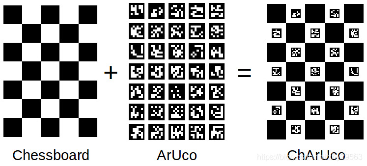

# 定位 Localization
## Marker
### Aruco
汉明码编码，双数列数据位
[在线生成器](https://chev.me/arucogen/)

### ChArUco
Chessboard具有高的交点精度，但是交点提取比较困难。ArUco能够快速检测，但即使使用亚像素精度提取，提取的交点精度也不甚理想。ChArUco集成了Chessboard的高精度与ArUco易用性的优点。

### Vumark
可以定制，以紧密反映公司的品牌标识。

## PnP（Perspective-n-Point）算法
求解3D到2D点对运动的方法。解决的问题是：给定3D点的坐标、对应2D点坐标以及内参矩阵，估算相机所在的位姿

- DLT 直接线性变换
- P3P 三对点估计位姿
- EPnP(Efficient Pnp)
- BA(Bundle Adjustment) 光速法平差

[PnP(Perspective-n-Point)问题：各种算法总结分析
](https://zhuanlan.zhihu.com/p/399140251)

### DLT
根据n个点的世界坐标和相机归一化平面坐标，最后一行用于消去深度，得到个约束方程，利用SVD求解超定方程并得到位姿矩阵的估计。

https://zhuanlan.zhihu.com/p/58648937

**冷知识**：[SVD分解，V的最后一列是最小二乘的解](https://wenku.baidu.com/view/fc8b345901768e9951e79b89680203d8ce2f6ae1.html)

**思考**：本质上是求外参矩阵（12个未知数，虽然有约束关系，但是不考虑），一个点能消除2个未知数，所以6个点以上能通过线性的方式解出来。

### P3P
根据3个点的世界坐标和相机归一化平面坐标，利用余弦定理几何关系，得到3个点的相机坐标，将问题转化为3D-3D位姿估计并利用ICP求解，最后还需要一对点用于验证。

**思考**：已知一个锥体的底面和截面，求底面相对于截面的坐标。

### EPnP
根据n个点的世界坐标选择4个控制点并计算加权系数，通过相机模型和个点的像素坐标求解4个控制点在相机坐标系下的坐标，进而得到n个点在相机坐标系下的坐标，将问题转化为3D-3D位姿估计并利用ICP求解。

**思考**：P3P加强版

### BA
根据对应点的重投影误差构建非线性优化问题，利用李代数得到误差关于位姿的导数以指导优化方向，不断迭代求得所有对应点重投影误差之和最小的位姿估计。

**思考**：先随便猜一个位姿，计算对应的2D截面，通过与实际的误差进行反馈，不断纠正，最后得到正确的位姿