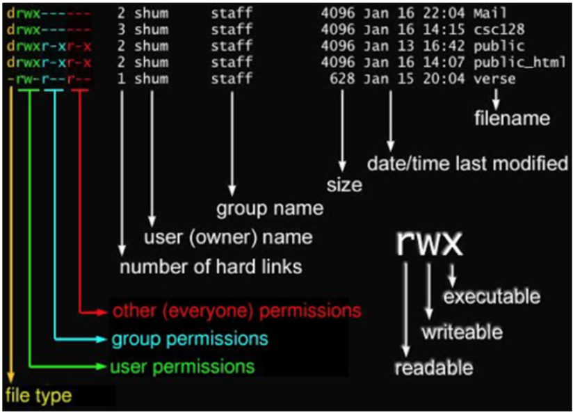

# Linux
## **系统目录**
目录的解释：    
1./bin：bin是Binary的缩写, 这个目录存放着最经常使用的命令。 

2./boot： 这里存放的是启动Linux时使用的一些核心文件，包括一些连接文件以及镜像文件。     

3./dev ： dev是Device(设备)的缩写, 存放的是Linux的外部设备，在Linux中访问设备的方式和访问文件的方式是相同的。   

4./etc： 这个目录用来存放所有的系统管理所需要的配置文件和子目录。   

5./home：用户的主目录，在Linux中，每个用户都有一个自己的目录，一般该目录名是以用户的账号命名的。 
  
6./lib：这个目录里存放着系统最基本的动态连接共享库，其作用类似于Windows里的DLL文件。    

7./lost+found：这个目录一般情况下是空的，当系统非法关机后，这里就存放了一些文件。   

8./media：linux系统会自动识别一些设备，例如U盘、光驱等等，当识别后，linux会把识别的设备挂载到这个目录下。

9./mnt：系统提供该目录是为了让用户临时挂载别的文件系统的，我们可以将光驱挂载在/mnt/上，然后进入该目录就可以查看光驱里的内容了。

10./opt：这是给主机额外安装软件所摆放的目录。比如你安装一个ORACLE数据库则就可以放到这个目录下。默认是空的。

11./proc：这个目录是一个虚拟的目录，它是系统内存的映射，我们可以通过直接访问这个目录来获取系统信息。

12./root：该目录为系统管理员，也称作超级权限者的用户主目录。

13./sbin：s就是Super User的意思，这里存放的是系统管理员使用的系统管理程序。

14./srv：该目录存放一些服务启动之后需要提取的数据。

15./sys：这是linux2.6内核的一个很大的变化。该目录下安装了2.6内核中新出现的一个文件系统 sysfs 。

16./tmp：这个目录是用来存放一些临时文件的。

17./usr：这是一个非常重要的目录，用户的很多应用程序和文件都放在这个目录下，类似于windows下的program files目录。

18./usr/bin： 系统用户使用的应用程序。

19./usr/sbin： 超级用户使用的比较高级的管理程序和系统守护程序。

20./usr/src： 内核源代码默认的放置目录。

21./var：这个目录中存放着在不断扩充着的东西，我们习惯将那些经常被修改的目录放在这个目录下。包括各种日志文件。

22./run：是一个临时文件系统，存储系统启动以来的信息。当系统重启时，这个目录下的文件应该被删掉或清除。

23./www:存放服务器网站相关的资源，环境，网站的项目

## **一些不常用但可能会用到的指令**
### **sudo useradd [username] / sudo userdel [username]**
新建/删除用户

### **su [username]**
切换用户

### **passwd**
修改密码

### **sudo usermod [options][username]**
修改用户属性

### **cat /etc/passwd **
查看用户

用户名：密码：UID（用户ID）：GID（组ID）：描述性信息：主目录

###  **cat /etc/group**
查看用户组

组名：用户组密码：组标识号：组内用户列表

### **newgrp [groupname]  / groupdel [groupname] **
切换/删除用户组

### **ll/ls -l**
查看目录下所有文件的权限

### **sudo chown/ sudo chgrp**
修改文件属主和属组

### **df / du**
显示系统/某个文件或目录磁盘用量

### **sudo fdisk**
对磁盘进行分区操作

### **mkfs**
磁盘格式化

### **mount/unmount**
磁盘挂载与卸载

### **tree [derectory name]**
树状显示指定目录下的内容

### **find [path]**
-path -ipath -name -iname -type 

找路径

### **where [filename]**
找文件

### **touch [filename]/ > [filename] / echo "text" > [filename]**
创建文件/将字符重定向到文件中

### **ps/kill**
process status，查看进程/终至进程

### **grep [正则表达式] [文件和目录]**
查找匹配目录
#### **正则表达式**
|  表达式   | 含义  |
|  ----  | ----  |
| ^word  | 搜寻以word开头的行 |
| word$  | 搜寻以word结束的行 |
| .  | 匹配任意一个字符 |
| \c  | 转义\后面的特殊字符C，在正则表达式中有特殊含义的字符必须要先转义才能使用 |
| c*  | 表示*前面的字符c可以重复0次到多次 |
| [list]  | 匹配一系列字符中的一个 |
| [n1-n2]  | 匹配一个字符范围，如[0-9]la-z]中的一个字符 |
| [^list]  | 匹配一系列字符以外的字符 |
| \\<word  | 匹配以word开头的单词 |
| word\\>  | 匹配以word结尾的单词 |
| c? | 匹配0个或1个字符C，即c既可以出现也可以不出现 |
| c+  | 表示+前面的字符c可以重复1次到多次，注意跟*有区别 |
| \|  | 表示"或”，匹配一组可选的字符或字符串 |

### **输入输出重定向**
|  命令格式   | 作用  |
|  ----  | ----  |
| 命令<文件  | 将指定文件作为命令的输入设备。 |
| 命令<<分界符 | 表示从标准输入设备（键盘） 中读入，直到遇到分界符才停止（读入的数据不包括分界符），这里的分界符其实就是自定义的字符串。|
| 命令>文件 | 将命令执行的标准输出结果重定向输出到指定的文件中，如果该文件已包含数据，会清空原有数据，再写入新数据。|
| 命令2>文件 | 将命令执行的错误输出结果重定向到指定的文件中，如果该文件中已包含数据，会清空原有数据，再写入新数据。|
| 命令>>文件 | 将命令执行的标准输出结果重定向输出到指定的文件中，如果该文件已包含数据，新数据将写入到原有内容的后面。|
| 命令2>>文件 | 将命令执行的标准输出结果重定向到指定的文件中，如果该文件已包含数据，新数据将写入到原有内容的后面。|
| 命令>>文件2>&1或者 命令＆>>文件 | 将标准输出或者错误输出写入到指定文件，如果该文件中已包含数据，新数据将写入到原有内容的后面。|

### **管道 [command1] | [command2] | [command3] ...**
把上一个命令的输出当作下一个命令的输入

### **shell 脚本**
变量前加$ ： echo $HOME #环境变量   

删除变量： unset a

定义数组：array=(value0 value1 value2)

读取数组元素 echo ${array[0]} 

读取所有元素 echo ${array[@]}

条件语句：  
if condition    
then    
    command1    
elif condition2     
then        
    command2        
else    
    command 
fi  

循环语句：  
while condition     
do      
    command     
done    

for var in item1 item2 ... itemN    
do      
    command1    
    command2    
    ....    
done    

函数：  
function test(){    
    echo "参数1:\${1}!";     
    echo "参数2:\${2}!";     
    n=\$((\${1}+${2}));
    return $n;    
}

调用：  
test 1 2 3; #传参数     
echo $?;    #显示上一条指令的返回值

运行shell脚本：./test.sh #不能写成test.sh，否则回去环境变量中找

结束其参数运行：bash test.sh

查看全局变量：env

查看个别全局变量：printenv HOME 或者 echo $HOME

修改环境变量：export PATH=/usr/local/src/mongodb/bin:$PATH

立即生效 source [filename] #本意是执行每行命令

### **SSH=secure shell**