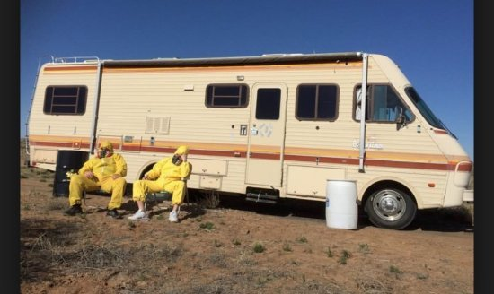
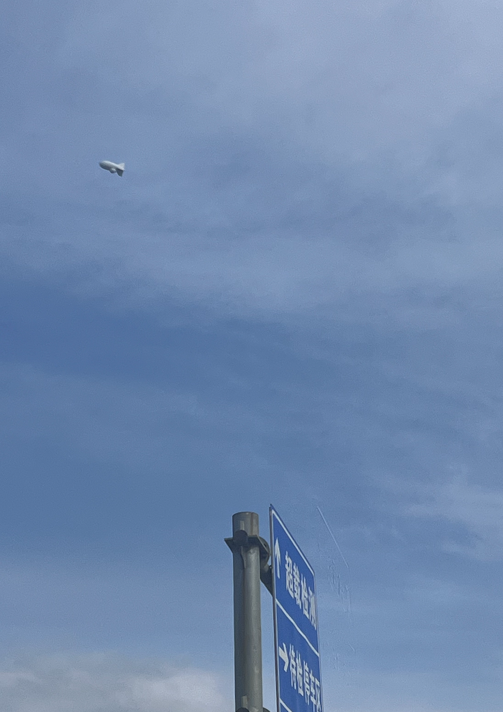
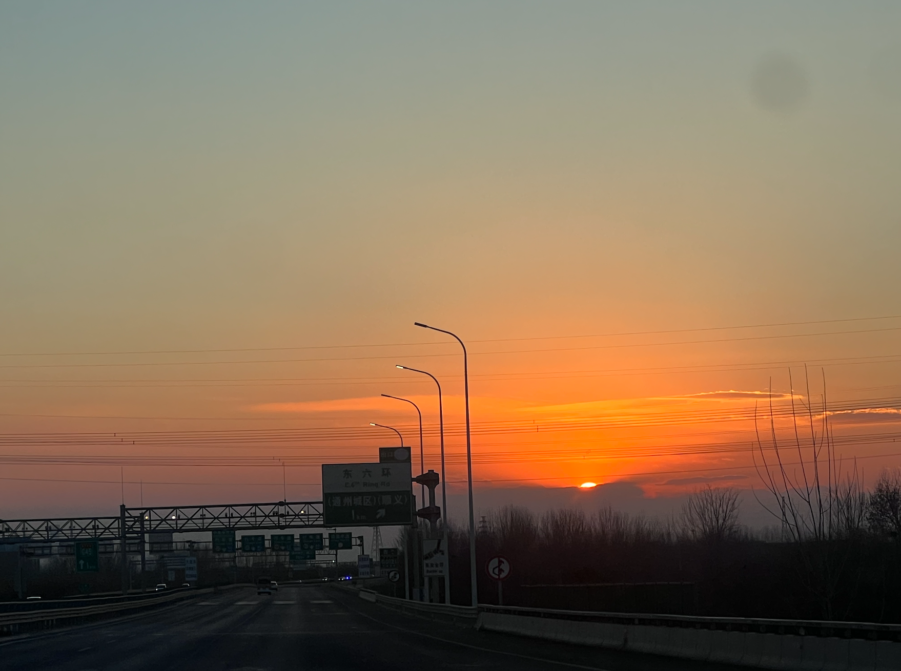
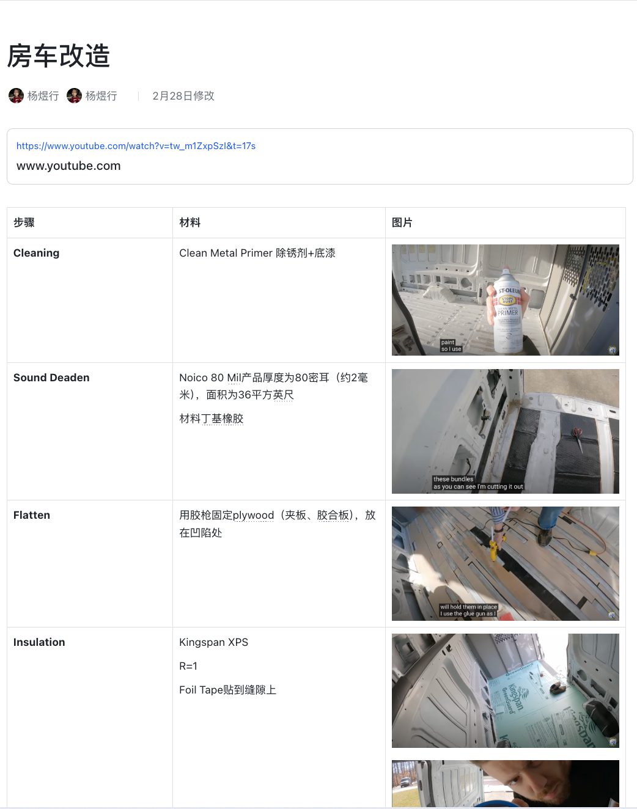
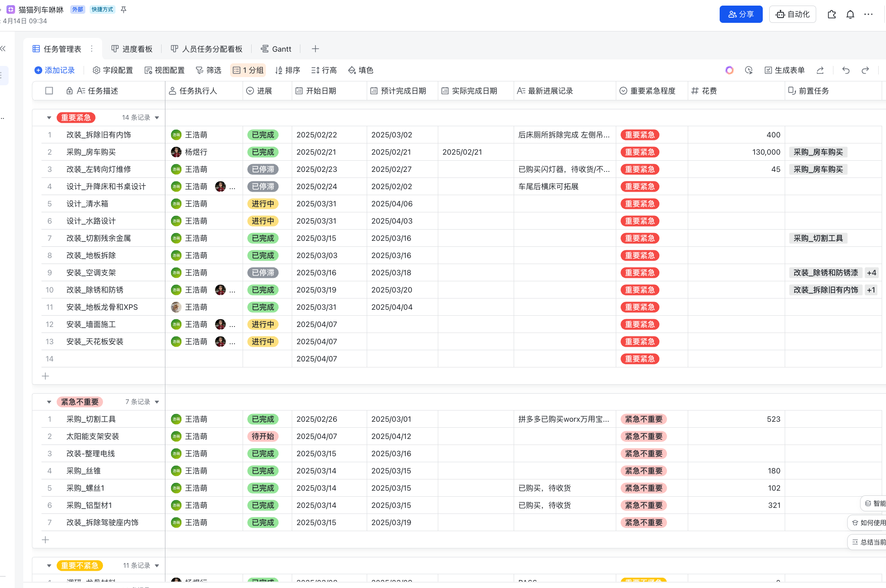
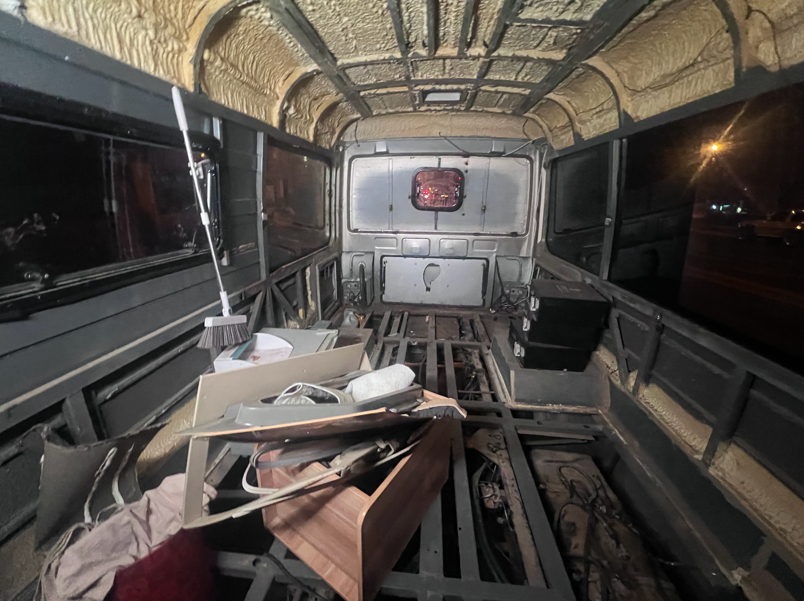
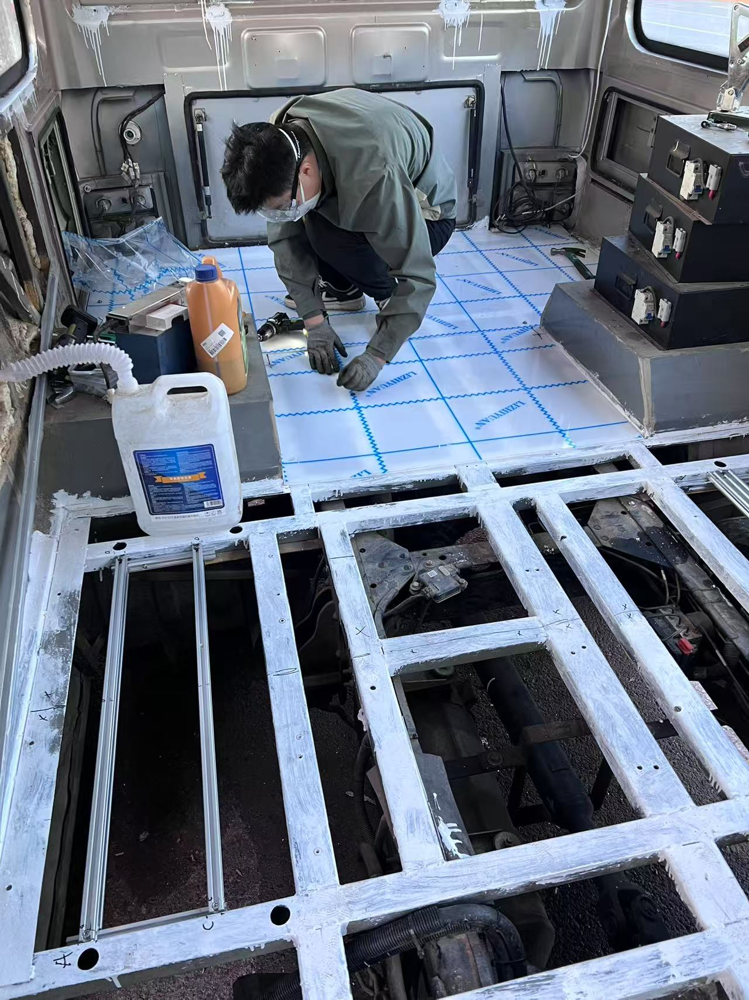
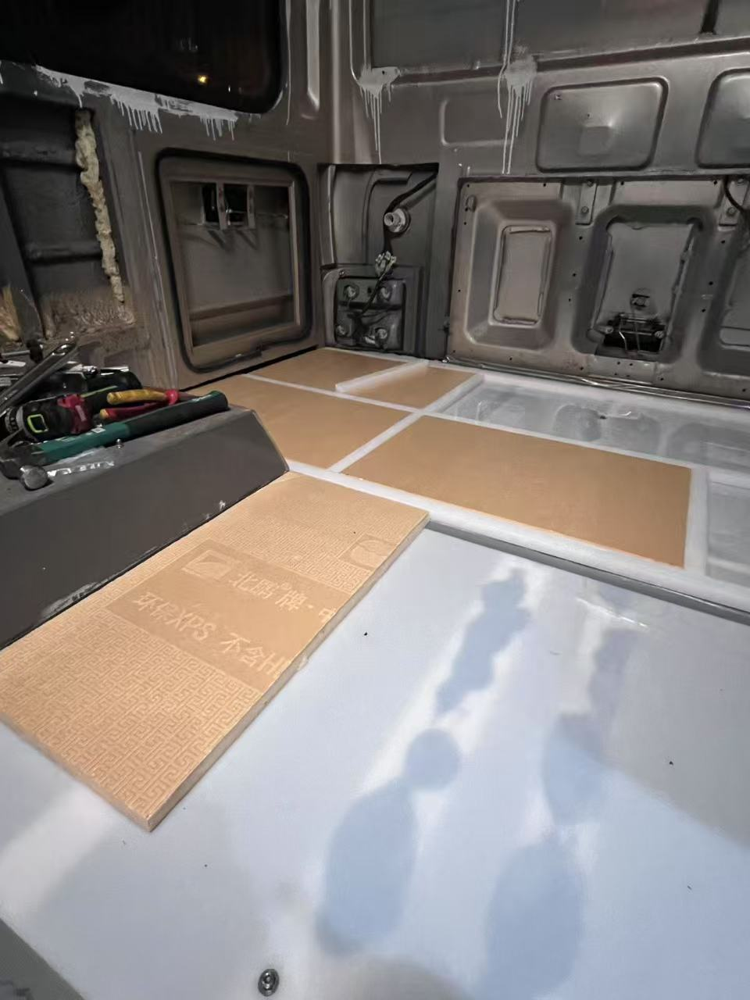
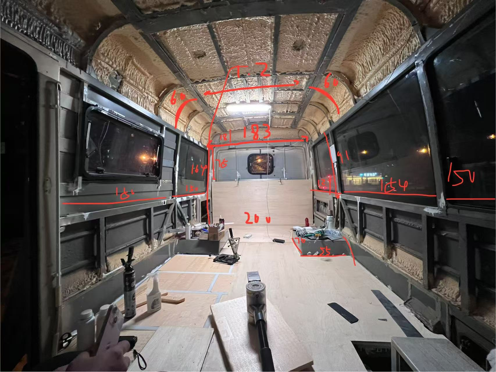

# 房车日记
## 2024/6-2024/10
事情的开始很简单，来自于一年前Homo的一句“我们有可能住进房车不租房吗”。

当然，那个时候的我并没有把这件事情放在心上，因为在我心里“住进房车”这个概念的太模糊了。我对房车的认知还只是停留在那辆新墨西哥的黄色大巴士。这事儿就这样先轻飘飘的过去了。

没想到之后的一个月Homo开始给我狂吹枕边风。

这些我都是不在意的，纯当作他像小孩的臆想。

直到他说：

这我可心动了，毕竟在我从小到大的TODO List里，去看世界是雷打不动的第一项。这太酷了。

于是我们坐下来开始认真盘算这件事。

我们先从当下考量，当时我们住在一个一室一厅的整租房里，房租是4900每个月，加上燃气水电大概是5000出头，一年大概6w左右。

而经过他大量研究之后sourcing到的一款房车大概10万出头。我们预估的改装费用是4-5w左右。

也就是说不考虑市场流通性的话，住2-3年就完全回本了，更何况2-3年后价值也不会太低。

平时我们也可以开着出去玩，能省掉很多住宿费用和租车费用。

另外我俩都不是那种打算上班上一辈子的人，觉得差不多在自己的行业能学到一些东西，做出一些成绩，就可以把副业转为自由职业保持收入去看看世界了。房车会成为我们想走就走的依靠。

于是我们一拍即合，开始选车了。

## 2025/1-2025/2

我们做了一些事情提前了解房车生活是怎么样的，需要怎么改造房车。

我们租了一辆额头床的车周末去露营（其实是为了去看流星），还带上了猫猫，彩虹糖和朵朵都适应的很好，棉花糖一如既往的胆小。

我们还去参观了房车展，学习了房车厂的布局。当然全程Homo都在吐槽房车厂的钱都花在刀把上。

我们的目标很明确，因为我们有两个人和三只猫猫，所以我们需要在已知限制下一个空间足够大的房车；需要C照也能开无需额外考驾照（没时间）。此外还有很多限制，比如北京只能国五以上的车进、19年以前的车内部没做备案可以随便改装；内高要大于185cm（因为homo有185）。

我们打算年后把车买回来，于是在一月开始集中对比江铃考斯特的车型。大概两周就选上了一款就在一百多公里之外的唐山的宽体考斯特，18年的里程才1w多公里。售价13w。

于是2月21日，我们坐上了去往唐山的大巴。

## 2025/2/21
那天我们早早出发，坐在从四惠出发的大巴上，路上还看到了一个超级可爱的气艇。

大概中午十二点到唐山，吃了个饭卖我们车的大哥就过来了。我们上车tour了一圈，他问我们有没有问题，我们心想，反正都要全拆了的。他开着车带着我们溜了一圈，就这样，我们把钱付了，前往车管所过户了。

开回来的时候，隔着驾驶舱喧嚣的发动机声，Homo对我说，感觉好不真实啊我们就这样拥有自己的房车了。我说是的，我们有自己的车了，我们也快有自己的家了。

那时距离我们毕业，才过了一年半。

## 2025/2
### 规划
车到手了，就按照我们的计划开始改造了，第一个要做的是地板。之前一直都是Homo在研究，我是属于全程被carry和push。在他的强迫下我做了一些个调研文档。这次我们要兼顾稳定、保温、防水，并检索了很多van life博主的视频，甚至做了一个调研文档。看了很多视频，大部分都是用木条做龙骨、木板做层板。考虑到我们每天都要住在这里面，肯定经常会把水洒在地上，决定地板大部分都选用塑料。从这里开始我对高分子合成材料很感兴趣了....

在从各大视频里学习来的&集成了两个工科生23年来的科学常识和生活经验，集众家之精华后，我们（实际上是Homo，我只负责采购）终于提出了一个野路子！

用尼龙做龙骨，XPS填充，然后直接上木板，最后上PVC地板革。

我们非常理想，期望一切如无bug的代码一样通畅进行，还列了一个详细的列表。但....真实情况是一边干活一边做方案的，毕竟后面我们才发现，计划赶不上变化快....

### 拆车 - 2 Weeks
第一步目标还是很明确的，就是要把现在的所有东西都拆掉。当时我比较犹豫的是地板感觉还不错也要拆吗，但是仔细因为是木地板，看很多地方已经泡水糟烂了。

于是我们准备全拆掉，并重新做一个地板。

Homo花了两周，经过一些不正确的工具（比如把万用宝电池耗干）摸索终于把地板拆干净了。

至此我们遇到了改车第一坑：也没人告诉我拆空了以后只剩架子了呀。

简直是天崩开局，那是北京的初春，凉凉的风从车底呼呼往上吹。于是我们紧急sourcing什么材料可以有能力把这个底面补起来。

最后在淘宝紧急下单了几片5mm厚的尼龙板，用拉铆打上的。听起来简单，实则花了一周的时间....把地板完全封上不用再围着高领毛衣避风的时候，我们终于卸了一口气：我们有地板了。

## 2025/3-2025/5
### 搭地板- 2 Weeks
尼龙底板铺起来以后我们仍小心翼翼，毕竟也不好说如此单薄的板是否能支撑起一个80kg一个45kg。扛着七八根尼龙条到车边，我们开始做龙骨和XPS了。

XPS是我在闲鱼上找到的，便宜又结实，在昌平的一个建材城，用着Homo的打车余额一次性运了20张回来。（BTW最后在零售商那里买的时候发现比他进货价还便宜）

从这里开始练成了画直线的手法。

我们还亲自去通州的木材厂取料，

其实最困难的部分应该是修剪形状合适的木板，从这时开始我们遇到了伴随整整六个月的第二大坑：

车是歪的。

是的，车不仅不对称，还是歪的。

地板大概花了2-3周的时间。

### 搭墙- 1 Weeks
地板大概做了两周左右。接着我们开始做墙了。

面对着深陷的铁皮，我们只能用一块又一块xps去填这无底洞。然后用一块块板子盖上。

大概做了一周（和地板有overlap），每天都在核算怎么切割和分配木板，能刚好搭在龙骨上。

### 搭天花板- 1 Weeks

其实天花板是这里面最快但是最难的一部分，因为真的需要一个人撑着一个人打螺丝，很麻烦。

而且最后铺起来也不太平整.....

Anyways至此大概也算一个毛坯房了。

### 驾驶室 - 1 Weeks

驾驶室真的是最困难的一部分，首先需要把两个驾驶座拆掉好铺地板，接着需要把撕掉的PVC剩下的胶一点点除掉。

在选隔音毡的时候选了日本的，可能有用吧。

又经过一些精妙的反复裁剪做出了木材。

果然在一番操作下发动机声音小了许多，开车的时候我都能听到Homo说话了。

这段时间有很多朝阳大爷大妈们路过来问我们是不是房车，怎么改的。了解到很多大爷大妈自己也有房车....对房车认识度很高，偶尔还会聊一聊他们的子女，有时两个大妈会在我们门口聊起来。

### 铝型材家具
我们的房租四月三十号到期，我们合计了一下觉得五月再短租个一个多月应该就能搬到房车里了。于是我在小红书上紧急找了一个只剩一个半月的转租（当然发现这个屋子的坑后面再说），开始时间是5/3，而我们当前的房子的结束时间是4/30。于是我们决定在4/30-5/3的时候趁五一假期，把车弄成能睡的样子，然后出去玩几天又回来。

紧赶慢赶我们开始搭铝型材了，这种精妙的拼接艺术对我们来说还是有点太过复杂，我们量尺寸就量了两个晚上。紧急定了一批铝型材后他kuku开干，当然前面的框架基本上都是Homo做的，因为这段时间我在忙着收家。此外我因为换了一份工作通勤时间变长了许多，所以这段时间主力确实都是他。

就那么一两天Homo就把床、座位的形状拼了个大概，我们紧急把木板装上。那天已经4/30号了，我们两个都请了白天的假。

做到七点的时候我开始意识到有点来不及了，于是我赶紧回家收拾打扫。

十点多我们开始陆陆续续搬东西下来，最重的属那个床垫了....没有露营车我都不敢想有多比溃。

甚至上车前我们还在刷清漆。

过了一会儿，天亮了。那是2025年的第一个通宵。

搬到七点钟终于把东西都落上车了，因为很多东西用不上，我们把几箱放到了公司。收拾完困的不行在公司停车场睡了三个小时。

接着我们就带着猫猫前往去威海的路上了。

### 2025/5
开开心心前往威海的路上，没想到还没出六环车就抛锚了。

打着火过一会儿就熄了，我们紧急停在了路边，给交警打电话报备以后给最近的江铃修车厂保修，第一次坐上了拖车.....

到了修车厂以后还得看着猫猫不要跑出去。

修了一个多小时，还用专业的设备连车机，也不知道修了个啥，就说查不出问题。

花了五百块钱买了个心安以后，我们继续上路了。

刚出几百米又开始熄火了....但这次我们应该是不能再回去了。Homo灵光一现说他好像知道怎么重新打火了。

于是这一路我们就这样开一会儿熄一会儿的跑了一千公里....跑到后来Homo都掌握规律了，他说只要到达某个转速就必熄火。

到了威海我们先住了一天的海边庄园，当天在景点倒车的时候就把一辆特斯拉后备箱创坏了，因为修车的时候把雷达修坏了😓

没有保险赔了2000。

但是没有关系，不影响我们继续玩。

第二天我们决定停在沙滩边，看到了很美的日落。

回来路上遇到堵车，还在天津的加油站睡了一觉。

突然明白了房车旅行的意义，是不需要有过多的担心不需要到处search酒店考虑距离，随时有个backup。

### 2025/5-2025/6
回来以后我们搬进了海淀短租的一个小房间，独卫但是10平，很难保持稳定的温度，刚好rehearsal一下房车...

我们把车停到了小区附近的一片无人之地，旁白是荒芜的野草，这一溜停了几十辆外地车.....

旁白一个车是一个老丰田，四面的窗都被遮住了，每天我们晚上去干活的时候都会看见有个哥住在里面，旁白就停着他的小电驴，偶尔还会请两个朋友过来把后备箱敞开喝酒。

大平层是北京，四合院是北京，这也是北京。

旁边就是草丛，一到晚上小蚊虫就会顺着光线飞进车里，每天都要被叮很多次。

在这边我们做了零零碎碎的事情，比如把空调移位、窗框、各种储物架、驾驶室门和天花板都补齐。

房租快到期了，但是天也变热了，也住不进去，于是我们准备再短租一段。

### 2025/6-2025/7

这次我们连夜搬到了清河。这次也是短租，租期到七月底。但我们核算了一下这次应该能搞定了。

本来车还在上一个小区附近，但是有一天突然拉了条说旁边要做开发了，第二天就要搬走不然要拖车。于是我们把车停到了清河站旁边一块无人之地。

这段时间我们的重点主要是set up 水电。主要做的事是选型水箱，连接部分水管，采买了电池。

七月初我爸爸妈妈来北京玩了，就这样和homo分居了一周，也停滞了一周。

由于停在清河交警一直给我们发提醒（虽然不罚款），我们决定停到公司楼下。

这段时间我们发现离schedule有点紧了，于是抓紧把太阳能板买了，花了一个晚上把四片20kg的太阳能板装上了。

然后又把逆变器和电闸买了，Homo酷酷把线接起来了，我们终于有空调用了！

然后把卫浴装了。

这时离房租到期只有两周了，我们意识到软装是一点没做，立刻开始刷漆。然后速速定了卫生间墙板和门、安装层板。铺地板。

漆和地板铺起来以后终于觉得像家了。

此时离我们搬进去还有4天，但是水没有完全ready。

Homo连夜修了三四天，终于没有遇到太大的bug，感觉可以住进去了。

### 2025/7/31
2025年7月31日，是我们带着三只猫猫搬进来的第一天。

那天下班我骑着电动车跑了八趟把东西全搬了过来。Homo在车里整理。

那天我觉得无比幸福，再也不用担心被扣押金，不用在乎通勤，不用每年都找一次房子，每年都搬一次家。

孟母也没在三个月里迁三次。

我们看似漂泊了，但实则安定了。

### 2025/8
搬进来以后修修补补，列了50条代办...

家也越来越像家。

但是有一天物业突然来敲门说这里不能住人。我们收拾了一周搬去了公司对面的停车场。

其实也不能完全避免和没有啊包容性的人打交道。

Homo常常跟我说他很焦虑，我说没有关系的我们扛造性很强，是可以睡大街的那种人（翻译为能吃苦）。当然我知道他是一个比我还J的超级大J人，面对未知的工作量和bug时未免会感到焦虑，同时做这件事情有过多的不确定性，不像工作一样有人给你清晰的指引，很多事情需要自己摸索，焦虑也在所难免。虽然我也是一个J人，但是我在这方面心态就很好，我觉得做不完也不是不行，比较佛系。

当然自从我们开始干活以后，Homo常常以同事的姿态要求我，我说我连打螺丝都不配，因为确实做不好。也经常吵架，吵到后面我已经皮了，反正也改不了，就这样吧....

我的收获也是非常非常多的：

首先在无数次的测量过程中，我对长度的把握能力很强了，一眼能估计大概2m内的长度。

画直线能力也变强了。

认识了超级多材质。

理解了很多结构。

对这个世界的认识更深刻了。对不同领域的深入让我逐渐从“Know difference”到“Know Why”且“Know How”。比如以前知道一些装修好看，但不知道我们和他有什么区别。之后知道了是因为木饰不一样，灯光不一样....

感觉成长了很多。

另外这个事情真的是闷声干大事，干了整整150天只有几个人知道。

这次就写到这，准备整理一下文档做视频，其他的进展以后再写吧～